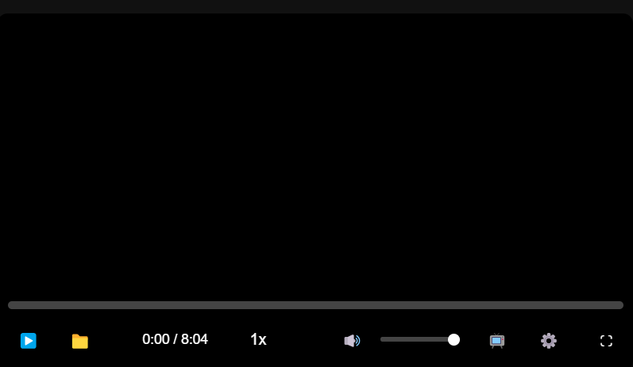

# CustomVideoPlayer

Un lecteur vidéo personnalisé et moderne créé en JavaScript pur, sans dépendances externes.

## Fonctionnalités

- **Interface élégante** avec contrôles qui se masquent automatiquement
- **Prévisualisation au survol** de la barre de progression avec génération d'images miniatures
- **Sélecteur de qualité vidéo** pour différentes résolutions
- **Contrôle de vitesse de lecture** (0.25x à 2x)
- **Mode Picture-in-Picture** pour regarder la vidéo en fenêtre flottante
- **Mode plein écran** optimisé
- **Indicateurs visuels** pour les actions importantes (pause, volume, etc.)
- **Raccourcis clavier** pour une navigation rapide
- **Entièrement personnalisable** via CSS et options JavaScript
- **Compatible mobile** avec une interface responsive

## Installation

1. Copiez les fichiers `customVideoPlayer.js` et `customVideoPlayer.css` dans votre projet
2. Incluez-les dans votre page HTML :
